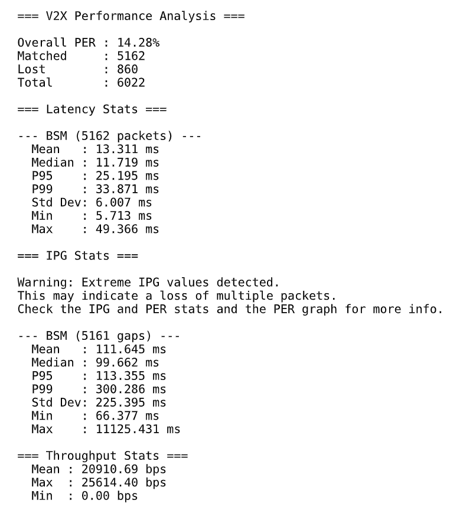

# C-V2XPerformanceAnalyzer
This repository is a software tool to automatically measure and assess performance of C-V2X networks based on C-V2X interoperability testing packet datasets and the SAE J2735 message standard.

## Installation Steps

### Install uv

uv is a package manager that is used with this project. All the required libraries and packages are displayed in "uv.lock". In order to use it, install uv with the following command depending on your OS:

**Windows** (PowerShell):
 
```powershell
powershell -ExecutionPolicy ByPass -c "irm https://astral.sh/uv/install.ps1 | iex"
```
 
**Linux**:
 
```bash
curl -LsSf https://astral.sh/uv/install.sh | sh
```
 
Close and reopen your terminal afterward so `uv` is on your PATH. Confirm with
`uv --version`.

### Clone the project:

With git installed, clone the repository and move into it with:
```bash
git clone https://github.com/eysong/C-V2XPerformanceAnalyzer.git
cd C-V2XPerformanceAnalyzer
```
If you do not have git, install it from https://git-scm.com/ or manually download and extract the zip of this project and cd into it.

### Get the required libraries:
While in the project directory, run
```bash
uv sync
```
to get all of the required libraries to run it, excluding tkinter.

Tkinter is not able to be installed on uv, so you must install it separately with
```bash
sudo apt install python3-tk
```

## Formatting Data

The currently supported format for data in this project is Packet Description Markup Language (PDML) files. 

**Two** PDMLs are required per run (1 for transmitter, 1 for receiver).

You can convert packet captures **in wireshark** or use **tshark** commands to do so.

Captures must have J2735 fields dissected, otherwise the analyzer cannot read their fields and cannot perform analysis.

## Usage: Command Line

One method to run the project is through command line.

There are also two ways to run the project through command line, dependent on the contents of the transmitter's pdml file. 

**Separate transmitter capture files:**

```bash
uv run V2XPerformanceAnalyzer.py tx.pdml rx.pdml
```

**Combined transmitter file:**

With a combined Tx/Rx transmitter file, you'll want to filter through the packets by giving the transmitter's IPv6 or MAC address as a third argument. Example:
```bash
uv run V2XPerformanceAnalyzer.py combined.pdml rx.pdml AA:BB:CC:DD:EE:FF
uv run V2XPerformanceAnalyzer.py combined.pdml rx.pdml 2001:db8::1
```
Finally, if you wish to run **spatial analysis** (trail map, distance graph), you may add the **receiver's** location using degrees latitude and longitude, ensuring they are comma-separated. Example:
 ```bash
uv run V2XPerformanceAnalyzer.py tx.pdml rx.pdml --rx-location 30.00000,-50.0000
```

- Statistics are also printed to the console as the run proceeds.
 
 ## Usage: GUI
 
 If using the GUI built into the project, ensure tkinter is installed, and run it with the following command:
 ```bash
uv run V2X_Analyzer_GUI.py
```
GUI instructions:

1. Browse to the transmitter PDML file and the receiver PDML file.
2. If the transmitter file is a combined capture, enter the transmitter's MAC or
   IPv6 address in the optional address field.
3. To generate the map and distance graph, check "Generate trail map + distance
   graph" and enter the receiver's latitude and longitude.
4. Click "Run Analysis". Progress appears in the result box as the analyzer runs.
5. When it finishes, the result box lists the output files. They are stored in the same place as the transmitter file.
   Use "Open Report Folder" to open that folder.

The GUI and `V2XPerformanceAnalyzer.py` must be in the same folder — the GUI
locates the analyzer relative to its own location.


## Output format
Outputs go to three potential files:
 
The output defaults to the folder where the project is run, and outputs the following files:
The analyzer writes its results to the folder it is run from:
 
- `v2x_report.pdf` — statistics followed by one graph per page
- `v2x_report.docx` — the same report as a Word document
- `trail_map.html` — the transmitter trail, only when `--rx-location` is given for CLI or the checkbox for spatial analysis is used for GUI
## Example output

Running the analyzer produces a report beginning with a statistics summary,
followed by one graph per page. An example of the first page is something like this:




## Notes
- Clock synchronization between the two device is required for accurate absolute latency readings. If negative values are detected as a result of clock desynchronization, a warning is given to the user in the console and the report. Regardless, the range of the latency values is still meaningful.

- Trailing lost packets after the last received packet are treated as the receiver having stopped or turned off. They are not present in the analysis if any are found, and a notice is given to the user.

- If any transmitter files have multiple devices, multiple runs are required to analyze all of them.

- Spatial analysis requires BSMs or other message types that give location information. Otherwise, the spatial analysis will not work. 

- Certain parameters (ex. PER window size) are hardcoded, and must be changed in code.

- Packets without a currently supported J2735 message ID (BSM, SPaT, etc.) are excluded from analysis.


## References
- Datasets:
   - NIST Interoperability Testing Data: https://data.nist.gov/od/id/mds2-3541
   - OmniAir Maryland PlugFest 2026 Datasets
   - NIST Outdoor Testing Data
- SAE J2735 Standard: https://www.sae.org/standards/j2735_202409-v2x-communications-message-set-dictionary

- GUI Design: Sedric Su
   - https://github.com/eysong/C-V2XMsgExchangeAssessingTool

---